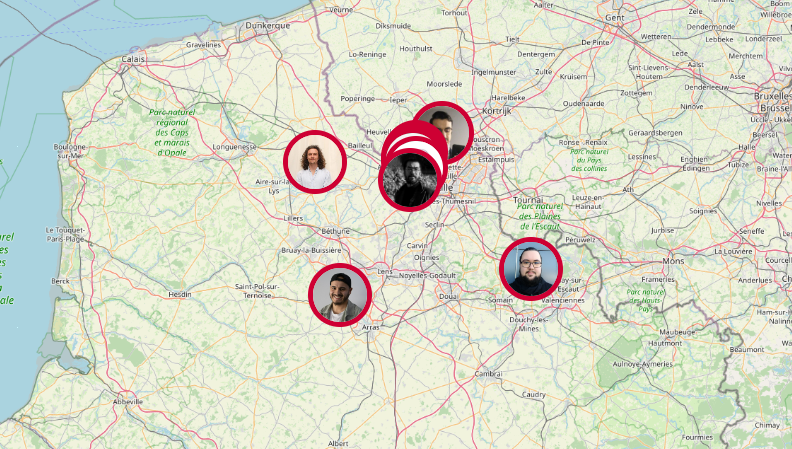

# 2023 CDA alternance spécialisation DEVOPS P4

Titre Professionnel  
**Concepteur Développeur d'Applications - Spécialisation DevOps**  
Hauts-de-France

## Qui sommes nous

    

    <a href="https://trombi-tm.vercel.app" target="_blank" align="center">https://trombi-tm.vercel.app</a>

## Les technologies utilisées

&nbsp;&nbsp;

&nbsp;&nbsp;

&nbsp;&nbsp;

&nbsp;&nbsp;

&nbsp;&nbsp;

&nbsp;&nbsp;

&nbsp;&nbsp;

&nbsp;&nbsp;

&nbsp;&nbsp;

&nbsp;&nbsp;

## Nos réalisations

| Briefs | Technologies | <a href="https://github.com/mbeauvois">Marine</a> | <a href="https://github.com/AudreyAAOO">Audrey</a> | <a href="https://github.com/Melcn">Mélanie</a> | <a href="https://github.com/NassJs">Nassim</a> | <a href="https://github.com/YassineElazzati">Yassine</a> | <a href="https://github.com/AlexTakoDev">Alexandre</a> | <a href="https://github.com/PierreFrs">Pierre</a> | <a href="https://github.com/dgo-gco">Diego</a> | <a href="https://github.com/CamilleLafrance">Camille</a> | <a href="https://github.com/zakkios">Zakaria</a> | <a href="https://github.com/Eromnoj">Jonathan</a> | <a href="https://github.com/DKHexDev">Thomas</a> | <a href="https://github.com/Ludoph">Ludovic</a> | <a href="https://github.com/TheoPIERSON">Théo</a> | <a href="https://github.com/Thorgardd">Jérémy</a> |
| :----: | :----: | :----: | :----: | :----: | :----: | :----: | :----: | :----: | :----: | :----: | :----: | :----: | :----: | :----: | :----: | :----: |
| [S'approprier le REAC](https://github.com/2023-cda-alt-devops-p4/reac) |  | <a href="https://github.com/2023-cda-alt-devops-p4/reac-mb">🔗</a> | <a href="https://github.com/2023-cda-alt-devops-p4/reac-ac">🔗</a> | <a href="https://github.com/2023-cda-alt-devops-p4/reac-mc">🔗</a> | <a href="https://github.com/2023-cda-alt-devops-p4/reac-nd">🔗</a> | <a href="https://github.com/2023-cda-alt-devops-p4/reac-ye">🔗</a> | <a href="https://github.com/2023-cda-alt-devops-p4/reac-af">🔗</a> | <a href="https://github.com/2023-cda-alt-devops-p4/reac-pf">🔗</a> | <a href="https://github.com/2023-cda-alt-devops-p4/reac-dg">🔗</a> | <a href="https://github.com/2023-cda-alt-devops-p4/reac-cl">🔗</a> | <a href="https://github.com/2023-cda-alt-devops-p4/reac-zl">🔗</a> | <a href="https://github.com/2023-cda-alt-devops-p4/reac-jm">🔗</a> | <a href="https://github.com/2023-cda-alt-devops-p4/reac-tm">🔗</a> | <a href="https://github.com/2023-cda-alt-devops-p4/reac-lp">🔗</a> | <a href="https://github.com/2023-cda-alt-devops-p4/reac-tp">🔗</a> | <a href="https://github.com/2023-cda-alt-devops-p4/reac-jr">🔗</a> |
| [Catalogue de diagrammes](https://github.com/2023-cda-alt-devops-p4/catalog) | &nbsp;&nbsp; | <a href="https://github.com/2023-cda-alt-devops-p4/catalog-mb">🔗</a> | <a href="https://github.com/2023-cda-alt-devops-p4/catalog-ac">🔗</a> | <a href="https://github.com/2023-cda-alt-devops-p4/catalog-mc">🔗</a> | <a href="https://github.com/2023-cda-alt-devops-p4/catalog-nd">🔗</a> | <a href="https://github.com/2023-cda-alt-devops-p4/catalog-ye">🔗</a> | <a href="https://github.com/2023-cda-alt-devops-p4/catalog-af">🔗</a> | <a href="https://github.com/2023-cda-alt-devops-p4/catalog-pf">🔗</a> | <a href="https://github.com/2023-cda-alt-devops-p4/catalog-dg">🔗</a> | <a href="https://github.com/2023-cda-alt-devops-p4/catalog-cl">🔗</a> | <a href="https://github.com/2023-cda-alt-devops-p4/catalog-zl">🔗</a> | <a href="https://github.com/2023-cda-alt-devops-p4/catalog-jm">🔗</a> | <a href="https://github.com/2023-cda-alt-devops-p4/catalog-tm">🔗</a> | <a href="https://github.com/2023-cda-alt-devops-p4/catalog-lp">🔗</a> | <a href="https://github.com/2023-cda-alt-devops-p4/catalog-tp">🔗</a> | <a href="https://github.com/2023-cda-alt-devops-p4/catalog-jr">🔗</a> |
| [On est là](https://github.com/2023-cda-alt-devops-p4/trombi) | &nbsp;&nbsp; | <a href="https://github.com/2023-cda-alt-devops-p4/trombi-mb">🟢</a> | <a href="https://github.com/2023-cda-alt-devops-p4/trombi-ac">🟠</a> | <a href="https://github.com/2023-cda-alt-devops-p4/trombi-mc">🟠</a> | <a href="https://github.com/2023-cda-alt-devops-p4/trombi-nd">🔵</a> | <a href="https://github.com/2023-cda-alt-devops-p4/trombi-ye">🟤</a> | <a href="https://github.com/2023-cda-alt-devops-p4/trombi-af">🟤</a> | <a href="https://github.com/2023-cda-alt-devops-p4/trombi-pf">🟡</a> | <a href="https://github.com/2023-cda-alt-devops-p4/trombi-dg">🟡</a> | <a href="https://github.com/2023-cda-alt-devops-p4/trombi-cl">🔴</a> | <a href="https://github.com/2023-cda-alt-devops-p4/trombi-zl">⚪</a> | <a href="https://github.com/2023-cda-alt-devops-p4/trombi-jm">🟢</a> | <a href="https://github.com/2023-cda-alt-devops-p4/trombi-tm">⚪</a> | <a href="https://github.com/2023-cda-alt-devops-p4/trombi-lp">🔵</a> | <a href="https://github.com/2023-cda-alt-devops-p4/trombi-tp">🔴</a> | <a href="https://github.com/2023-cda-alt-devops-p4/trombi-jr">🔗</a> |
| [Plateforme de streaming](https://github.com/2023-cda-alt-devops-p4/streaming) | &nbsp;&nbsp;&nbsp;&nbsp; | <a href="https://github.com/2023-cda-alt-devops-p4/streaming-mb">🔗</a> | <a href="https://github.com/2023-cda-alt-devops-p4/streaming-ac">🔗</a> | <a href="https://github.com/2023-cda-alt-devops-p4/streaming-mc">🔗</a> | <a href="https://github.com/2023-cda-alt-devops-p4/streaming-nd">🔗</a> | <a href="https://github.com/2023-cda-alt-devops-p4/streaming-ye">🔗</a> | <a href="https://github.com/2023-cda-alt-devops-p4/streaming-af">🔗</a> | <a href="https://github.com/2023-cda-alt-devops-p4/streaming-pf">🔗</a> | <a href="https://github.com/2023-cda-alt-devops-p4/streaming-dg">🔗</a> | <a href="https://github.com/2023-cda-alt-devops-p4/streaming-cl">🔗</a> | <a href="https://github.com/2023-cda-alt-devops-p4/streaming-zl">🔗</a> | <a href="https://github.com/2023-cda-alt-devops-p4/streaming-jm">🔗</a> | <a href="https://github.com/2023-cda-alt-devops-p4/streaming-tm">🔗</a> | <a href="https://github.com/2023-cda-alt-devops-p4/streaming-lp">🔗</a> | <a href="https://github.com/2023-cda-alt-devops-p4/streaming-tp">🔗</a> | <a href="https://github.com/2023-cda-alt-devops-p4/streaming-jr">🔗</a> |
| [Escape Odyssee](https://github.com/2023-cda-alt-devops-p4/escapeodyssee) |  | <a href="https://github.com/2023-cda-alt-devops-p4/escape-mb">🟢</a> | <a href="https://github.com/2023-cda-alt-devops-p4/escape-ac">⚪</a> | <a href="https://github.com/2023-cda-alt-devops-p4/escape-mc">🔵</a> | <a href="https://github.com/2023-cda-alt-devops-p4/escape-LP-ND-ZL">🟠</a> | <a href="https://github.com/2023-cda-alt-devops-p4/escape-ye">🔵</a> | <a href="https://github.com/2023-cda-alt-devops-p4/escape-af">⚪</a> | <a href="https://github.com/2023-cda-alt-devops-p4/escape-pf">🟡</a> | <a href="https://github.com/2023-cda-alt-devops-p4/escape-dg">🟢</a> | <a href="https://github.com/2023-cda-alt-devops-p4/escape-cl">🟢</a> | <a href="https://github.com/2023-cda-alt-devops-p4/escape-LP-ND-ZL">🟠</a> | <a href="https://github.com/2023-cda-alt-devops-p4/escape-jm">⚪</a> | <a href="https://github.com/2023-cda-alt-devops-p4/escape-tm">🟡</a> | <a href="https://github.com/2023-cda-alt-devops-p4/escape-LP-ND-ZL">🟠</a> | <a href="https://github.com/2023-cda-alt-devops-p4/escape-tp">🔵</a> | <a href="https://github.com/2023-cda-alt-devops-p4/escape-jr">🟡</a> |

## Nos projets

|  | <a href="https://github.com/mbeauvois">Marine</a> | <a href="https://github.com/AudreyAAOO">Audrey</a> | <a href="https://github.com/Melcn">Mélanie</a> | <a href="https://github.com/NassJs">Nassim</a> | <a href="https://github.com/YassineElazzati">Yassine</a> | <a href="https://github.com/AlexTakoDev">Alexandre</a> | <a href="https://github.com/PierreFrs">Pierre</a> | <a href="https://github.com/dgo-gco">Diego</a> | <a href="https://github.com/CamilleLafrance">Camille</a> | <a href="https://github.com/zakkios">Zakaria</a> | <a href="https://github.com/Eromnoj">Jonathan</a> | <a href="https://github.com/DKHexDev">Thomas</a> | <a href="https://github.com/Ludoph">Ludovic</a> | <a href="https://github.com/TheoPIERSON">Théo</a> | <a href="https://github.com/Thorgardd">Jérémy</a> |
| :----: | :----: | :----: | :----: | :----: | :----: | :----: | :----: | :----: | :----: | :----: | :----: | :----: | :----: | :----: | :----: |
| Projet | <a href="https://github.com/2023-cda-alt-devops-p4/my-project-mb">🔗</a> | <a href="https://github.com/2023-cda-alt-devops-p4/my-project-ac">🔗</a> | <a href="https://github.com/2023-cda-alt-devops-p4/my-project-mc">🔗</a> | <a href="https://github.com/2023-cda-alt-devops-p4/my-project-nd">🔗</a> | <a href="https://github.com/2023-cda-alt-devops-p4/my-project-ye">🔗</a> | <a href="https://github.com/2023-cda-alt-devops-p4/my-project-af">🔗</a> | <a href="https://github.com/2023-cda-alt-devops-p4/my-project-pf">🔗</a> | <a href="https://github.com/2023-cda-alt-devops-p4/my-project-dg">🔗</a> | <a href="https://github.com/2023-cda-alt-devops-p4/my-project-cl">🔗</a> | <a href="https://github.com/2023-cda-alt-devops-p4/my-project-zl">🔗</a> | <a href="https://github.com/2023-cda-alt-devops-p4/my-project-jm">🔗</a> | <a href="https://github.com/2023-cda-alt-devops-p4/my-project-tm">🔗</a> | <a href="https://github.com/2023-cda-alt-devops-p4/my-project-lp">🔗</a> | <a href="https://github.com/2023-cda-alt-devops-p4/my-project-tp">🔗</a> | <a href="https://github.com/2023-cda-alt-devops-p4/my-project-jr">🔗</a> |
| Backlog | <a href="https://github.com/orgs/2023-cda-alt-devops-p4/projects/42">🔗</a> | <a href="https://github.com/orgs/2023-cda-alt-devops-p4/projects/23">🔗</a> | <a href="https://github.com/orgs/2023-cda-alt-devops-p4/projects/43">🔗</a> | <a href="https://github.com/orgs/2023-cda-alt-devops-p4/projects/6">🔗</a> |  | <a href="https://github.com/orgs/2023-cda-alt-devops-p4/projects/35">🔗</a> | <a href="https://github.com/orgs/2023-cda-alt-devops-p4/projects/8">🔗</a> | <a href="https://github.com/orgs/2023-cda-alt-devops-p4/projects/29">🔗</a> | <a href="https://github.com/orgs/2023-cda-alt-devops-p4/projects/39">🔗</a> | <a href="https://github.com/orgs/2023-cda-alt-devops-p4/projects/7">🔗</a> | <a href="https://github.com/orgs/2023-cda-alt-devops-p4/projects/33">🔗</a> | <a href="https://github.com/orgs/2023-cda-alt-devops-p4/projects/5">🔗</a> | <a href="https://github.com/orgs/2023-cda-alt-devops-p4/projects/38">🔗</a> | <a href="https://github.com/orgs/2023-cda-alt-devops-p4/projects/28">🔗</a> | <a href="https://github.com/orgs/2023-cda-alt-devops-p4/projects/1">🔗</a> |
| GitHub | <a href="https://github.com/2023-cda-alt-devops-p4/app-mb">🔗</a> | <a href="https://github.com/2023-cda-alt-devops-p4/app-ac">🔗</a> | <a href="https://github.com/2023-cda-alt-devops-p4/app-mc">🔗</a> | <a href="https://github.com/2023-cda-alt-devops-p4/app-nd">🔗</a> | <a href="https://github.com/2023-cda-alt-devops-p4/app-ye">🔗</a> | <a href="https://github.com/2023-cda-alt-devops-p4/app-af">🔗</a> | <a href="https://github.com/2023-cda-alt-devops-p4/app-pf">🔗</a> | <a href="https://github.com/2023-cda-alt-devops-p4/app-dg">🔗</a> | <a href="https://github.com/2023-cda-alt-devops-p4/app-cl">🔗</a> | <a href="https://github.com/2023-cda-alt-devops-p4/app-zl">🔗</a> | <a href="https://github.com/2023-cda-alt-devops-p4/app-jm">🔗</a> | <a href="https://github.com/2023-cda-alt-devops-p4/app-tm">🔗</a> | <a href="https://github.com/2023-cda-alt-devops-p4/app-lp">🔗</a> | <a href="https://github.com/2023-cda-alt-devops-p4/app-tp">🔗</a> | <a href="https://github.com/2023-cda-alt-devops-p4/app-jr">🔗</a> |
| En&nbsp;ligne |  | <a href="https://app-ac.groupedeparole.fr">⭐</a> |  |  |  |  | <a href="https://licensync-simplonp4.pierrefraisse.dev">⭐</a> |  | <a href="https://endozen.camlafr-dev.ovh">⭐</a> | <a href="https://myvoice.zakkios.fr">⭐</a> | <a href="https://cda.jomoreschi.fr">⭐</a> | <a href="https://techpro-frontend.cdadevops.ovh">⭐</a> |  | <a href="https://spartan.theopierson.fr">⭐</a> | <a href="https://bankroute-frontend.cdadevops.ovh">⭐</a> |

<!-- &emsp;Briefs :   -->
&emsp;&emsp;[1️⃣ Mon projet](https://github.com/2023-cda-alt-devops-p4/my-project) : étude d'avant-projet.  
&emsp;&emsp;&emsp;[2️⃣ La vision de mon projet](https://github.com/2023-cda-alt-devops-p4/my-vision) : maquettage de l'application.  
&emsp;&emsp;&emsp;&emsp;[3️⃣ Hello from API 🙂](https://github.com/2023-cda-alt-devops-p4/app) : lancement en un clic.  
&emsp;&emsp;&emsp;&emsp;&emsp;[4️⃣ Planification Agile](https://github.com/2023-cda-alt-devops-p4/planification) : pilotage du projet.  
&emsp;&emsp;&emsp;&emsp;&emsp;&emsp;[5️⃣ Bâtir les fondations](https://github.com/2023-cda-alt-devops-p4/fondation) : conception et premier CRUD.  
&emsp;&emsp;&emsp;&emsp;&emsp;&emsp;&emsp;[6️⃣ Sur le front](https://github.com/2023-cda-alt-devops-p4/on-the-front) : création de l'interface utilisateur.  
&emsp;&emsp;&emsp;&emsp;&emsp;&emsp;&emsp;&emsp;[7️⃣ Authentification](https://github.com/2023-cda-alt-devops-p4/authentification) : implémentation de l'authentification.  
&emsp;&emsp;&emsp;&emsp;&emsp;&emsp;&emsp;&emsp;&emsp;[8️⃣ Déploiement](https://github.com/2023-cda-alt-devops-p4/deployment) : mise en ligne.  
&emsp;&emsp;&emsp;&emsp;&emsp;&emsp;&emsp;&emsp;&emsp;&emsp;[9️⃣ Micro-Service](https://github.com/2023-cda-alt-devops-p4/microservice) : sauvegarde des événements.  

## Auteurs, contributeurs

* [Nicolas Herbez](https://github.com/nicolas-herbez)
* [Cyril Marcq](https://github.com/CyrilMarcq)
* [Jean-Baptiste Lavisse](https://github.com/jblavisse)
